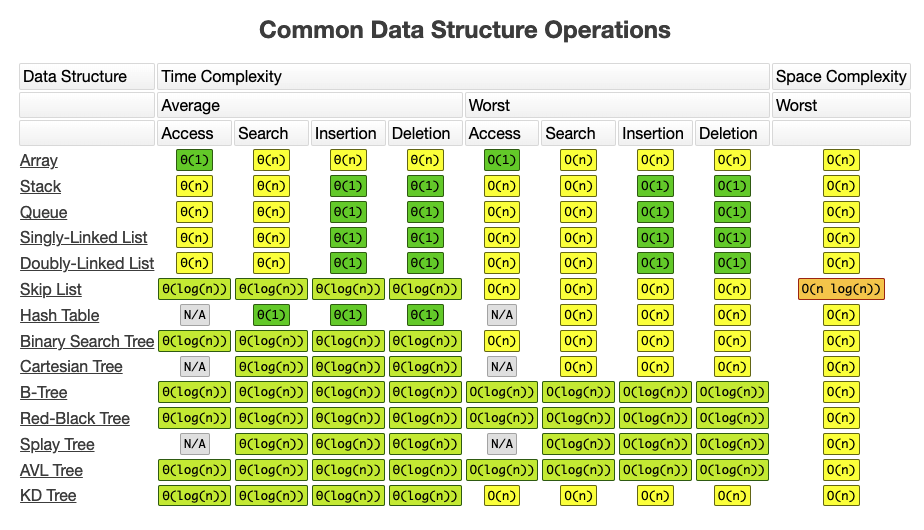

<h1 align="center"> Big-O </h1>

<h3><i>Scalable Code is the basis of Big O Notation</i></h3>
<ul>
  <li>Speed - time complexity</li>
  <li>Memory - space complexity (heap -> variables and stack -> function calls)</li>
</ul>

<h3>Big Os</h3>

O(1) <b>Constant</b> – no loops  
O(log N) <b>Logarithmic</b> – usually searching algorithms have log n if they are sorted (Binary Search)  
O(n) <b>Linear</b> – for loops, while loops through n items  
O(n log(n)) <b>Log Linear</b> – usually sorting operations  
O(n^2) <b>Quadratic</b> – every element in a collection needs to be compared to ever other element. Two
nested loops  
O(2^n) <b>Exponential</b> – recursive algorithms that solves a problem of size N  
O(n!) <b>Factorial</b> – you are adding a loop for every element you are iterating over  

** Iterating through half a collection is still O(n)  
** Two separate collections: O(a + b), if they are nested  O(a * b)  

<h3>What Can Cause Time in a Function?</h3>
<ul>
  <li>Operations (+, -, *, /)</li>
  <li>Comparisons (<, >, ==)</li>
  <li>Looping (for, while)</li>
  <li>Outside Function call (function()) </li>
</ul>

<h3>Rule Book</h3>
<b>Rule 1:</b> Always Worst Case  
<b>Rule 2:</b> Remove Constants  
<b>Rule 3:</b> Different terms for inputs 
<ul>
  <li>Different inputs should have different variables: O(a + b)</li>
  <li>A and B arrays nested would be: O(a * b)</li>
  <li>+ for steps in order</li>
  <li>* for nested steps</li>
</ul>
<b>Rule 4:</b> Drop Non-Dominant Terms  

<h3>What Causes Space Complexity?</h3>
<ul>
  <li>Variables</li>
  <li>Data Structures</li>
  <li>Function Call</li>
  <li>Allocations</li>
</ul>
